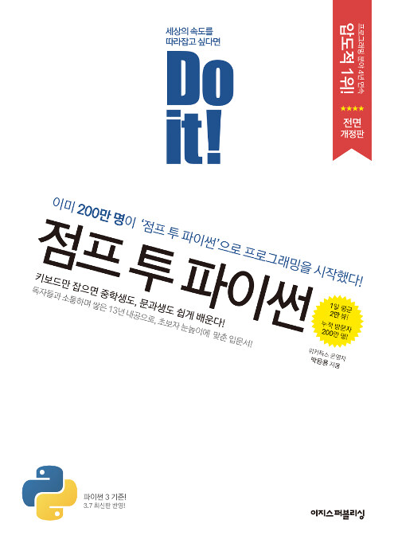

# 점프 투 파이썬 공부

## 기간 
- 2022.02.17 ~ 2022.03.03
## 작업환경
- OS : MacOS
- Python Version : 3.10.2
- IDE : VSCODE

### 01. 파이썬이란 무엇인가?
### 02. 파이썬 프로그래밍의 기초, 자료형
- 02-1. 숫자형
- 02-2. 문자열 자료형
- 02-3. 리스트 자료형
- 02-4. 튜플 자료형
- 02-5. 딕셔너리 자료형
- 02-6. 집합 자료형
- 02-7. 불 자료형
- 02-8. 자료형의 값을 저장하는 공간, 변수
### 03. 프로그램의 구조를 쌓는다! 제어문
- 03-1. if문
- 03-2. while문
- 03-3. for문
### 04. 프로그램의 입력과 출력은 어떻게 해야 할까?
- 04-1. 함수
### 05. 파이썬 날개 달기
- 05-1. 클래스
- 05-2. 모듈
- 05-3. 패키지
- 05-4. 예외 처리
- 05-5. 내장 함수
- 05-6. 외장 함수
### 06. 파이썬 프로그래밍, 어떻게 시작해야 할까?
### 07. 정규 표현식
- 07-1. 정규 표현식 살펴보기
- 07-2. 정규 표현식 시작하기
- 07-3. 강력한 정규 표현식의 세계로
